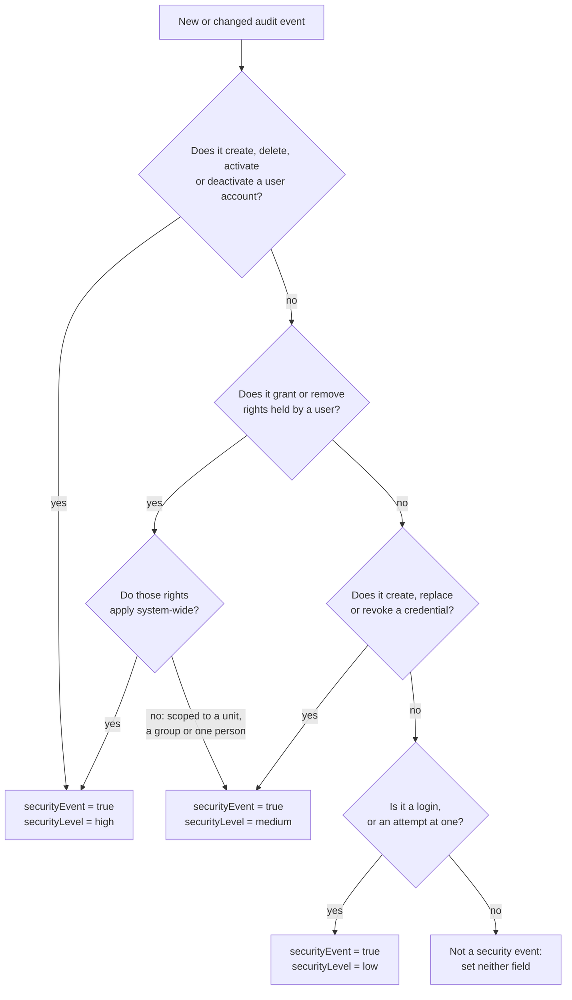

<!--
SPDX-FileCopyrightText: 2017-2026 City of Espoo

SPDX-License-Identifier: LGPL-2.1-or-later
-->

# Security Events

Certain audit events are also security events: they must be marked with `securityEvent = true` and a `securityLevel`, so that security monitoring can be built on filters applied to the audit log stream. `securityEvent` and `securityLevel` are constructor arguments on the `Audit` enum constant, and which event carries which marking lives in `Audit.kt`. For how audit events are produced, see [Audit logging](logging.md).

## Deciding the marking

Take the first branch that applies, so an action that fits two levels gets the higher one.

## Cases the tree does not settle

- **Reads are never security events**, sensitive ones included, and neither are ordinary data changes. Reads open only to a very narrow role would need their own marker; `securityEvent` is not it.
- **A `person` row is a data record, not an account.** What lets a citizen sign in is the credential attached to it.
- **In a flow spanning several events (e.g. employee mobile device pairing), the steps where an acting person is easily identifiable carry the level of what is being authorised**, while the steps a device or the gateway performs on its own stay `medium`.
- **An attempt should be logged at the level of what it attempts.**
- **Renaming a credential is not a security event at all** — it changes no authentication material.
- **The same operation carries the same marking wherever it is reached from**, and a scheduled job is marked like the same change made by a person.

These rules cover the Kotlin `Audit` enum; the API gateway hard-codes `securityEvent: true, securityLevel: 'low'` on every event it emits (`apigw/src/shared/logging.ts`).
